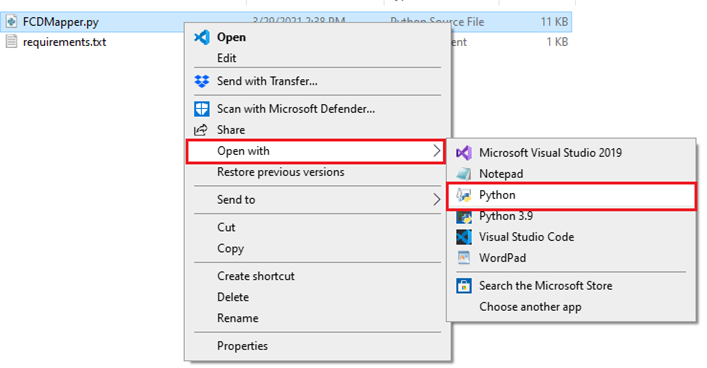
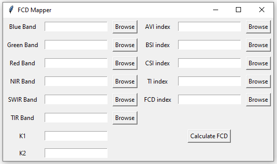
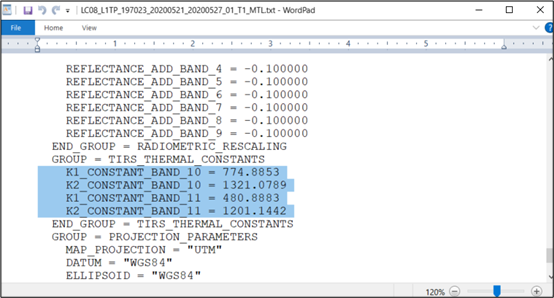

# Forest Canopy Density (FCD) Mapper

**Author:** Hasan Ahmed (https://hasanahmed.info)

## Introduction
Forest Canopy Density (FCD) is a critical biophysical parameter for forest management, vegetation health assessment, and decision-making. Originally developed by Rikimaru (1996), the FCD Mapper model provides a remote sensing approach to estimate FCD. While a semi-expert software package was created in 2002 by the International Tropical Timber Organization (ITTO) based on this model, it no longer supports modern Windows versions or Landsat 8 imagery.

This Python script enables users to estimate FCD from Landsat 8 imagery on any platform that supports Python 3 and required libraries.

## Requirements
1. **Python 3**: [Download here](https://www.python.org/downloads/).
2. **Python Libraries**: Listed in `requirements.txt`. Install all dependencies with:
   ```bash
   pip install -r requirements.txt
   ```
   Alternatively, install each package individually:
   ```bash
   pip install <package_name>
   ```
   - Required Packages: `rasterio`, `numpy`, `scikit-learn`

## Usage Instructions
1. Ensure Python and required packages are installed.
2. Open the `FCDMapper.py` file by right-clicking and selecting **Open With > Python**.

   

3. Upon opening, a Graphical User Interface (GUI) will appear. This interface allows you to:
   - Browse and select input bands and parameters.
   - Save output indices in a chosen directory.

    

4. **User Interface Instructions**:
   - Input bands (Red, Green, Blue, NIR, SWIR, and TIR) from Landsat 8 are required for FCD calculation.
   - Manually enter K1 and K2 parameters for the Temperature Index (TI) calculation.

5. **Running the Script**:
   - Once inputs are provided, click **Calculate FCD** to execute. Output indices are saved automatically.

## Input Preparation
This tool uses Landsat Collection 1 Level 1 data (Top of Atmosphere) for Landsat 8. For accurate FCD calculation:
- Ensure input images are cloud-free; mask any clouds, shadows, or water bodies.
- Each spectral band (Blue, Green, Red, NIR, SWIR, TIR) must be input separately to the GUI, with each band in the correct field.
- For TIR, either Band 10 or Band 11 can be used. However, additional parameters e.g. K1 and K2 constants corresponding to the selected bands have to be added in the K1 and K2 field of GUI. These parameters are required for Temperature Index (TI) calculation. The value of K1 and K2 for band 10 and band 11 can be found in the metadata file (MTL.txt) provided with the image. The highlighted text in the Figure 3 shows the values for K1 and K2 constants corresponding to band 10 and band 11.

   
  
**Spectral Band Details**:
| Band  | Name    | Range (µm)       | Data Type               |
|-------|---------|------------------|--------------------------|
| 2     | Blue    | 0.452 – 0.512    | 16-bit unsigned integer  |
| 3     | Green   | 0.533 – 0.590    | 16-bit unsigned integer  |
| 4     | Red     | 0.636 – 0.673    | 16-bit unsigned integer  |
| 5     | NIR     | 0.851 – 0.879    | 16-bit unsigned integer  |
| 6/7   | SWIR    | 1.566 – 2.294    | 16-bit unsigned integer  |
| 10/11 | TIR     | 10.60 – 12.51    | 16-bit unsigned integer  |

## Output
The script generates five indices as `GeoTiff` files: AVI, BSI, CSI, TI, and FCD. These indices can be used in GIS software (e.g., ArcGIS, QGIS) for further analysis, such as forest classification by FCD values.


## Contact
For issues or questions, please contact Hasan Ahmed (hahmed4@umbc.edu.
